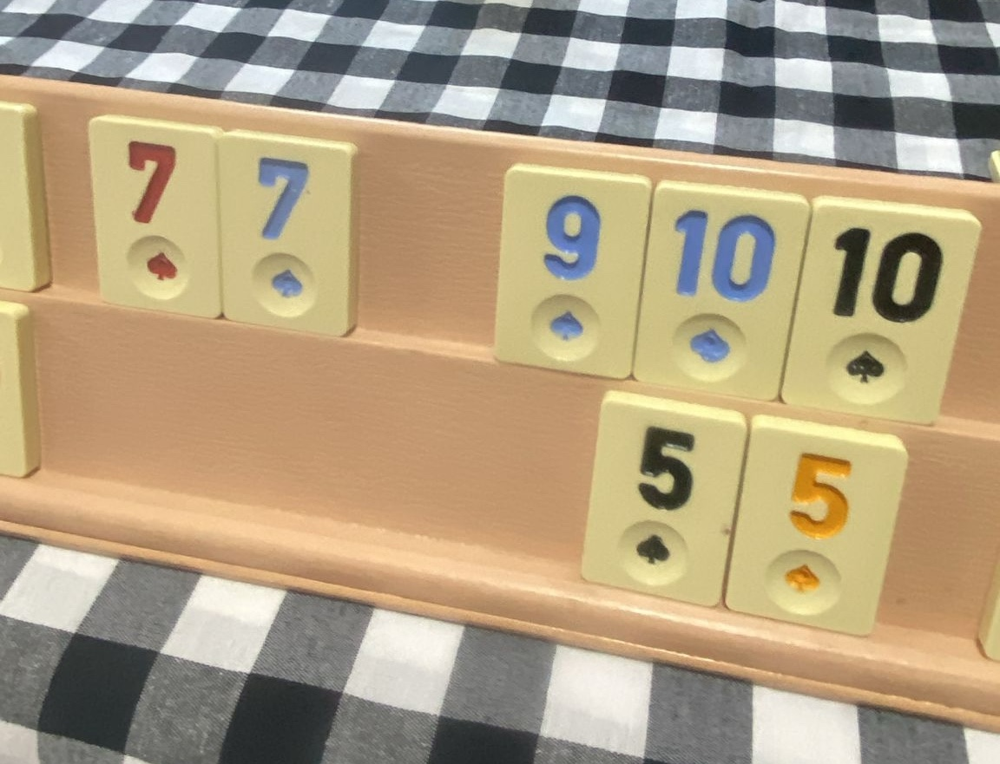
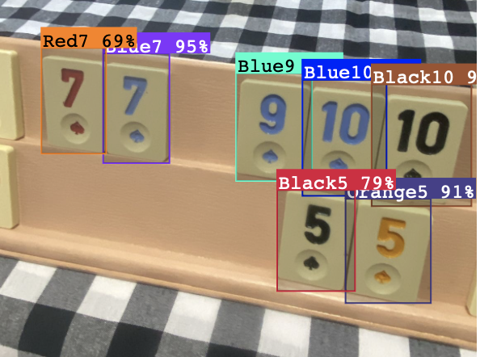
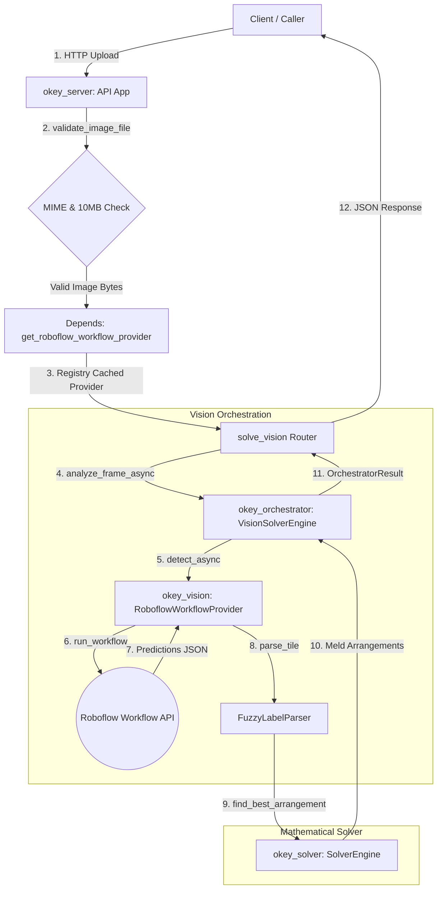

<p align="center">
    
</p>
<h1 align="center">Okey Solver</h1>

An enterprise-ready Python library for solving Okey & Rummikub board states, arranging hands, and processing layouts
with computer vision pipelines.

<p align="center">
    
    
</p>

[](./actions)
[](#-requirements)
[](./LICENSE)

---

## 🏗 Modular Package Architecture

The codebase is split into fully decoupled, high-performance packages under the `src/` directory:

1. **`okey_core`**: Holds shared domain types (`Tile`, `Meld`, `Arrangement`, `OrchestratorResult`) and exceptions.
   Completely independent.
2. **`okey_solver`**: Stateless mathematical engines to calculate optimal run/group melds and identical pairs. Uses
   slot-based DTO mapping (`LightTile`, `LightMeld`) to bypass Pydantic model loop overhead.
3. **`okey_vision`**: Translates frames (numpy, PIL, bytes, base64) into tile predictions. Queries the cloud Roboflow Workflow API (including the pretrained [Okey-Rummikub Model on Roboflow Universe](https://universe.roboflow.com/ata-dc7ry/okey-rummikub) trained on the [Okey-Data Kaggle Dataset](https://www.kaggle.com/datasets/atacanyaymac/okey-data)) to detect layouts. Decoupled from solver logic via an injectable `LabelParserStrategy`.
4. **`okey_orchestrator`**: Orchestrates pipelines by feeding vision outputs into the mathematical solver. Supports passing custom `SolverEngine` instances or a `strategy` string directly during setup.
5. **`okey_server`**: A microservice framework delivering endpoints for vision processing and hand arrangement.

---

## 📦 Installation

To install the core mathematical solver:

```bash
pip install okey-solver-py
```

To install computer vision extras:

```bash
pip install okey-solver-py[vision]
```

To install FastAPI server extras:

```bash
pip install okey-solver-py[server]
```

To install everything for development:

```bash
pip install okey-solver-py[vision,server]
```

---

## 💻 CLI Commands

The package exposes the following CLI commands:

- **`okey-solve`**: Solves hand arrangements from lists of tile arguments.
- **`okey-vision`**: Runs object detection predictions on an image layout using Roboflow workflows.
- **`okey-serve`**: Launches the FastAPI REST microservice API.
- **`okey-demo`**: Launches the local terminal solver demo application.

---

## 🚀 Quick Start

### 1. Basic Solver Arrangement

```python
from okey_solver import create_standard_okey_solver, Tile, TileColor

# Instantiates a stateless, independent engine
solver = create_standard_okey_solver(strategy="backtracking")

tiles = [
    Tile(id="r5", color=TileColor.RED, value=5),
    Tile(id="r6", color=TileColor.RED, value=6),
    Tile(id="r7", color=TileColor.RED, value=7),
]
result = solver.find_best_arrangement(tiles)
print(f"Total Score: {result.totalScore}")
```

### 2. End-to-End Orchestration (Vision + Solver with Strategy Selection)

```python
from okey_vision import RoboflowWorkflowProvider
from okey_orchestrator import VisionSolverEngine

# 1. Initialize vision model provider
provider = RoboflowWorkflowProvider(api_key="YOUR_ROBOFLOW_API_KEY")

# 2. Bind pipeline inside the orchestrator with strategy selection
# Supports strategy="backtracking", strategy="greedy", or passing a custom solver=instance
engine = VisionSolverEngine(pipeline=provider, strategy="greedy")

# 3. Analyze layout image and solve
result = engine.analyze_frame("board_layout.jpg")
print("Detected Tiles:", result.tiles)
print("Optimal Score:", result.arrangement.totalScore)
```

---

## 🌐 FastAPI Microservice (API Server)

Deploy this package directly to cloud infrastructure to process requests via HTTP:

### Start the Microservice

```bash
# Set environment variables for Roboflow Workflow
export OKEY_RF_KEY="your_api_key"

# Start the uvicorn instance on port 8000
okey-serve --port 8000
```

### Endpoints

- **`POST /solver/arrange`**: Accepts a JSON list of tile parameters and returns arranged melds.
- **`POST /vision/solve`**: Accepts an uploaded board image, detects the layout via Roboflow Workflows, and returns solved arrangements.
- **`POST /vision/extract`**: Accepts an uploaded board image, detects and returns the list of Okey tiles.
- **Interactive Swagger Docs**: Visit [http://localhost:8000/docs](http://localhost:8000/docs) to test requests in the
  browser.

---

## 📊 Capability Matrix

| Feature | Package | Mode | Capabilities |
| :--- | :--- | :--- | :--- |
| **State Resolution** | `okey_solver` | Sync | Stateless backtracking and greedy hand-arranging meld solvers. Supports circular run checks and Joker resolutions. |
| **Layout Detection** | `okey_vision` | Async / Sync | Multi-stage Roboflow Workflows querying, OCR labeling, confidence filters, and custom label mapping. |
| **E2E Orchestration** | `okey_orchestrator` | Async / Sync | Feeds images directly into `okey_vision` and pipes outcomes into `okey_solver` dynamically. |
| **FastAPI Microservice** | `okey_server` | Async | API exposing `/vision/solve` and `/vision/extract` with size (10MB) & MIME checks, instance registry caching, and safe error handling. |

---

## 🗺 System Flow & Architecture



---

## 📖 Extended Documentation

- 🧮 **[Solver Engines Guide](docs/SOLVER_ENGINES.md)** - Mathematical formulations, algorithmic flowcharts (Greedy, Backtracking, Hybrid, ILP), and execution performance matrix.
- 🏗 **[Architecture & Flow Reference](docs/ARCHITECTURE.md)** - Visual flow pipelines, observers, and providers.
- 📜 **[Game Rules Reference](docs/ALGORITHM_RULES.md)** - Explanations of run configurations, circular sequences, and
  Joker/False Okey rules.
- 💻 **[CLI Usage Guide](docs/CLI_USAGE.md)** - Terminal parameters for running predictions and solvers.
- 🤝 **[Contributing Guide](CONTRIBUTING.md)** - Guidelines for configuring local poetry environments and running
  Ruff/Mypy checks.
