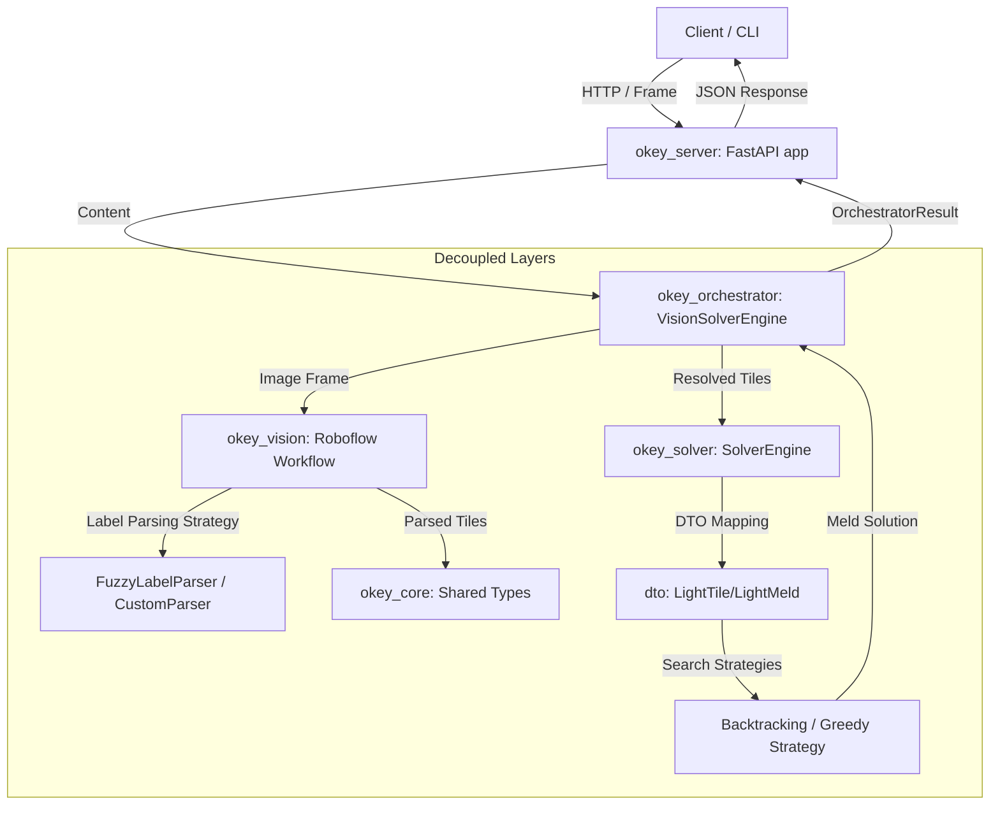

# Architecture & Flow

The python codebase is structured into two main submodules:
1. `okey_solver`: Handles mathematical board state resolution.
2. `okey_vision`: Coordinates image preprocessing, model detection, and class labeling.

## Workflow

## Model Provider

The `okey_vision` submodule uses the modern Roboflow Inference SDK Workflow API to query custom detection workflows on serverless infrastructure.

### `RoboflowWorkflowProvider`
Queries multi-stage visual logic workflows from Roboflow and parses the predictions into core tile models.
- **Dependencies**: `inference-sdk`.
- **Use Case**: Advanced visual logic workflows, hosting/scaling models in the cloud.

