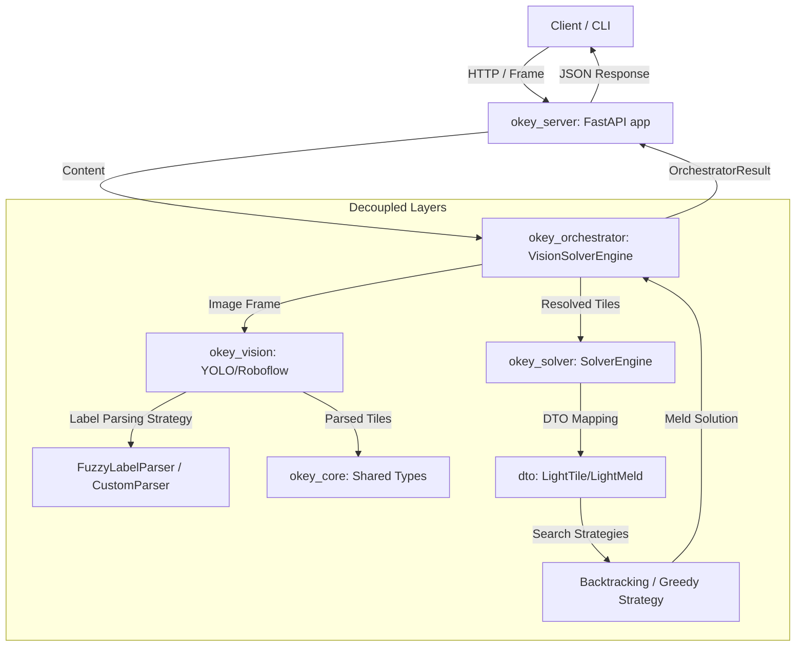

# Architecture & Flow

The python codebase is structured into two main submodules:
1. `okey_solver`: Handles mathematical board state resolution.
2. `okey_vision`: Coordinates image preprocessing, model detection, and class labeling.

## Workflow

## Model Providers

The `okey_vision` submodule supports multiple detection and classification backends via the following provider classes:

### 1. `LocalYoloProvider`
Runs detection locally using the `ultralytics` package with a local PyTorch model file (`.pt`).
- **Dependencies**: `ultralytics` (optional extra: `poetry install -E vision`).
- **Use Case**: Offline or low-latency local processing.

### 2. `RoboflowProvider`
Uses the HTTP-based Roboflow Object Detection API endpoints.
- **Dependencies**: `requests` (optional extra: `poetry install -E vision`).
- **Use Case**: Simple cloud-hosted object detection.

### 3. `RoboflowWorkflowProvider`
Uses the modern Roboflow Inference SDK Workflow API to query arbitrary custom detection workflows on serverless infrastructure.
- **Dependencies**: `inference-sdk`.
- **Use Case**: Advanced multi-stage visual logic workflows.

