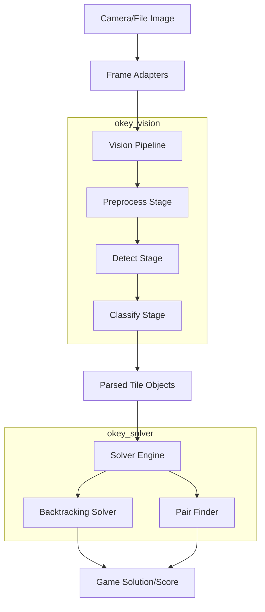

# Architecture & Flow

The python codebase is structured into two main submodules:
1. `okey_solver`: Handles mathematical board state resolution.
2. `okey_vision`: Coordinates image preprocessing, model detection, and class labeling.

## Workflow

