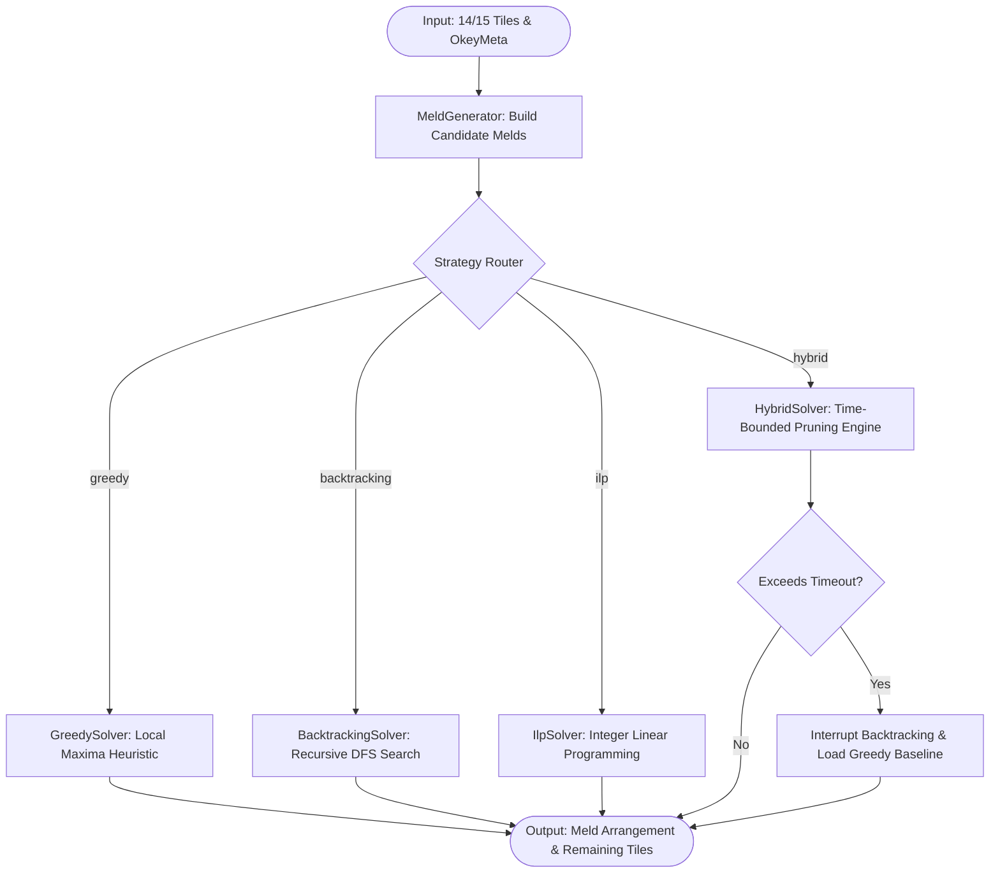
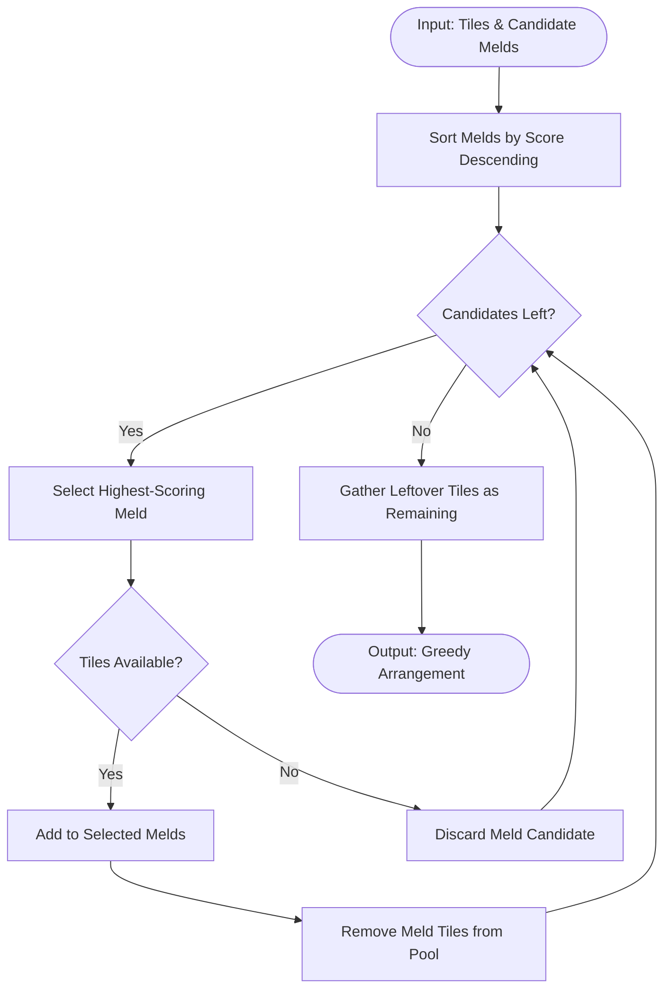
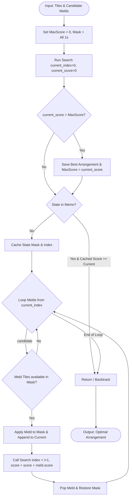

# Okey Solver Engines: Architecture and Implementation Guide

## 1. Introduction

The objective of the **okey-solver-py** library is to model and solve the hand arrangement optimization problem for the traditional Turkish tile game *Okey* (and its international relative, *Rummikub*). During a turn, a player holds a hand of 14 (or 15 when preparing to discard) tiles. The objective is to organize these tiles into valid combinations—specifically, **runs** (consecutive numbers of the same color, e.g., Red 5-6-7) and **groups** (the same value across different colors, e.g., Red 10, Black 10, Blue 10)—such that the number of unmelded (dead) tiles is minimized and the arrangement score is maximized.

Mathematically, Okey hand arranging is a variation of the NP-hard **Set Cover** and **Knapsack** problems. Given the set of all tiles in the hand, we generate the universe of all possible valid melds that can be constructed from these tiles. The solver must choose a subset of these melds that are mutually disjoint (since a physical tile can belong to at most one meld) while maximizing the utility of the covered tiles.

---

## 2. Architecture Overview

To achieve both high performance and mathematical optimality, `okey_orchestrator` implements a decoupled orchestrator pattern. The orchestrator receives the tile set and optional metadata (such as the wildcard *Joker* value), feeds them into the `MeldGenerator` to produce candidate sets, and routes the search problem to a specific solver engine based on the active configuration.

In production environments, the orchestrator acts as a hybrid router: it can execute the exact Integer Linear Programming (ILP) or Backtracking solvers, but fallback to the heuristic-driven Greedy solver if execution times exceed SLA limits (e.g., 50ms).

### 2.1 High-Level Orchestration Diagram



---

## 3. Solver Engines Detailed Specifications

### 3.1 Greedy Solver Engine

#### Concept
The Greedy Solver resolves the arrangement problem by iteratively selecting the single highest-scoring meld from the list of candidate melds, removing its constituent tiles from the available hand, and repeating the process until no further candidate melds can be formed.

#### Pros
- **High Performance**: Runs in $O(M \log M + M \cdot N)$ where $M$ is the number of candidate melds and $N$ is the number of tiles.
- **Low Memory Overhead**: Avoids recursion stacks and search trees.

#### Cons
- **Sub-optimality (Local Maxima)**: Picking the best local choice can destroy more valuable global combinations. For example, if a hand contains `[Red 5, Red 6, Red 7, Blue 6, Black 6]`:
  - The Greedy solver might pick the run `[Red 5, Red 6, Red 7]` first because it has 3 tiles.
  - Doing so leaves the remaining tiles `[Blue 6, Black 6]` dead.
  - However, if the hand also contained `[Yellow 6]`, using `[Red 6, Blue 6, Black 6, Yellow 6]` as a group and leaving `[Red 5, Red 7]` unmelded might yield a better score depending on the overall hand structure.

#### Algorithm Flowchart



---

### 3.2 Backtracking Solver Engine (DFS)

#### Concept
The Backtracking Solver executes an exhaustive Depth-First Search (DFS) over the power set of candidate melds. It maps each tile to a bitwise position in a bitmask. The solver recursively tries adding each meld, updating the bitmask to mark tiles as consumed, and backtracks to explore alternative branches.

#### Pros
- **Optimality**: Guarantees finding the mathematically optimal arrangement with the absolute minimum number of dead tiles.

#### Cons
- **Exponential Complexity**: Complexity is $O(2^M)$, where $M$ is the number of valid candidate melds. If the hand contains many wildcards or overlapping runs/groups, the search space expands and can cause CPU spikes.

#### Algorithm Flowchart



---

### 3.3 Hybrid / Time-Bounded Solver

#### Concept
The Hybrid Solver combines the speed of the Greedy heuristic with the accuracy of Backtracking. It first calculates a greedy baseline score. During backtracking, it applies **Branch & Bound** pruning: it calculates the maximum possible score a branch could yield by summing the current score and the remaining candidate melds' scores. If this upper bound cannot exceed the best score found so far, the branch is pruned. Additionally, it checks the elapsed time against a timeout threshold (e.g., 50ms); if exceeded, it aborts the search and returns the best solution found up to that point.

---

### 3.4 Integer Linear Programming (ILP) Solver

#### Concept
The ILP Solver models the hand arrangement as a binary optimization problem. We define a binary decision variable $x_j \in \{0, 1\}$ for each candidate meld $j$ in the candidate pool $M$. 

Let $s_j$ be the score of candidate meld $j$. The objective function is:
$$\text{Maximize } \sum_{j \in M} s_j x_j$$

Subject to the constraint that no tile $i$ in our hand $H$ is used in more than one selected meld:
$$\forall i \in H, \quad \sum_{j: i \in \text{meld}_j} x_j \le 1$$

This formulation is solved using standard solver libraries like `pulp` (invoking CBC). Because commercial and open-source ILP solvers use highly optimized C++ branch-and-cut algorithms, they resolve complex Okey hands containing multiple Jokers in under a millisecond.

---

### 3.5 Beam Search Solver
* **Concept**: Explores the top-$K$ best states (beam width) at each step to find high-scoring hand arrangements efficiently without traversing the whole tree.
* **Detailed Guide**: [Beam Search Solver Document](beam_search_solver.md)

---

### 3.6 Genetic Algorithm Solver
* **Concept**: Employs evolutionary operators (selection, crossover, mutation, elitism) combined with an overlap-repair heuristic.
* **Detailed Guide**: [Genetic Algorithm Solver Document](genetic_solver.md)

---

### 3.7 Simulated Annealing Solver
* **Concept**: Leverages simulated cooling to probabilistically accept worse configurations to avoid local minima.
* **Detailed Guide**: [Simulated Annealing Solver Document](simulated_annealing_solver.md)

---

### 3.8 Monte Carlo Tree Search (MCTS) Solver
* **Concept**: Explores the decision space using UCT selection, fast random rollouts/simulations, and backpropagation.
* **Detailed Guide**: [MCTS Solver Document](mcts_solver.md)

---

## 5. Performance & Decision Matrix

| Solver | Speed | Optimality Guarantee | Memory Usage | Best Used For |
| :--- | :--- | :--- | :--- | :--- |
| **Greedy** | Extremely Fast ($<1\text{ms}$) | None (Local Maxima) | Minimal ($O(M)$) | Real-time heuristic approximations, games with low turn time. |
| **Backtracking** | Variable ($1\text{ms} - 500\text{ms}$) | **Guaranteed** | Moderate ($O(M)$ recursion stack) | Small hands, offline analysis, hands with few overlapping melds. |
| **Hybrid** | Stable ($<50\text{ms}$) | High (Pruned search) | Moderate | Production API servers with strict SLAs. |
| **ILP (PuLP)** | Extremely Fast ($1\text{ms} - 5\text{ms}$) | **Guaranteed** | Moderate | Complex hands with multiple wildcards, server-side game engines. |
| **Beam Search** | Fast ($1\text{ms} - 10\text{ms}$) | High (Bounded search) | Minimal ($O(K)$) | Large hand searches with tight memory limitations. |
| **Genetic** | Moderate ($5\text{ms} - 25\text{ms}$) | High (Heuristic) | Moderate | Large search spaces where exact solvers are slow or unavailable. |
| **Simulated Annealing** | Fast ($2\text{ms} - 15\text{ms}$) | High (Heuristic) | Minimal | Fine-tuning complex hands to escape local minima. |
| **MCTS** | Moderate ($5\text{ms} - 30\text{ms}$) | High (Simulation-based) | Moderate | Hands with high branching factor and probabilistic rollouts. |

---

## 6. Future Enhancements: Probabilistic Evaluator (MCTS)

Arranging tiles is only half of the challenge when building an autonomous Okey Bot. While a solver arranges the hand, a **Probabilistic Discard Evaluator** is required to decide *which* unmelded tile to discard at the end of a turn. 

A Monte Carlo Tree Search (MCTS) or expected-value probability engine evaluates the remaining unmelded tiles in the arrangement. By counting the outstanding tiles in the deck (the 106-tile pool minus the cards in the player's hand and known discards), the engine calculates the probability of drawing the matching partner tiles required to complete a run or group in subsequent turns. The tile with the lowest expected probability of forming a future meld is prioritized for discard.

---

## 7. Example Usage & Engine Selection

Below is a Python code example demonstrating how to initialize the standard Okey solver using different engines and run the discard evaluator on leftover tiles:

```python
from okey_core.types import Tile, TileColor, OkeyMeta
from okey_solver import create_standard_okey_solver, DiscardEvaluator

# 1. Initialize different solver strategies
# Options: "backtracking", "greedy", "ilp", or "hybrid"
solver_backtracking = create_standard_okey_solver(strategy="backtracking")
solver_greedy = create_standard_okey_solver(strategy="greedy")
solver_ilp = create_standard_okey_solver(strategy="ilp")
solver_hybrid = create_standard_okey_solver(strategy="hybrid")  # Time-bounded (50ms)

# 2. Define a hand of tiles to solve
hand = [
    Tile(id="tile1", color=TileColor.RED, value=5),
    Tile(id="tile2", color=TileColor.RED, value=6),
    Tile(id="tile3", color=TileColor.RED, value=7),
    Tile(id="tile4", color=TileColor.BLACK, value=12),
]

# 3. Solve using the preferred engine (e.g. ILP for fast exact solving)
arrangement = solver_ilp.find_best_arrangement(hand)

print(f"Optimal Score: {arrangement.totalScore}")
for meld in arrangement.melds:
    print(f"  Meld ({meld.type.value}): {[f'{t.color.value}-{t.value}' for t in meld.tiles]}")

# 4. Evaluate remaining tiles for discard recommendations
evaluator = DiscardEvaluator()
discards = evaluator.evaluate_discards(hand, arrangement)

print("\nDiscard Recommendations (lowest connection strength first):")
for item in discards:
    t = item["tile"]
    print(f"  Discard candidate: {t.color.value}-{t.value} (Score: {item['score']}) - {item['explanation']}")
```
