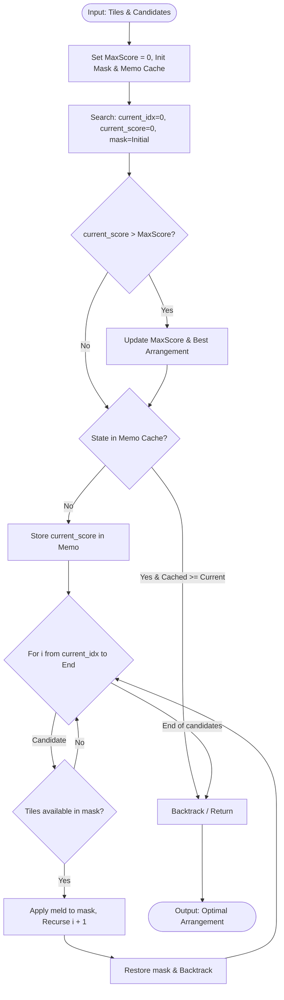

# Backtracking Solver Engine

## 1. Concept
The **Backtracking Solver** performs an exhaustive, recursive depth-first search (DFS) over all valid combinations of candidate melds. It uses memoization (caching visited subproblems) to skip redundant branches and guarantees finding the mathematically optimal arrangement.

---

## 2. Step-by-Step Workflow

1. **DTO & Bitmask Setup**: Map tiles to a bitmask where each tile is represented by a single bit (0 to $N-1$). An initial mask of `(1 << N) - 1` represents all tiles being available.
2. **Memoization Cache**: Use a cache mapping `(current_index, mask) -> score` to store the maximum score found when exploring candidates starting from `current_index` with `mask` tile availability.
3. **Recursive Search**:
   - At state `(current_index, mask, score)`:
     - If the current score is greater than the global max score, update the best arrangement.
     - Check if the subproblem `(current_index, mask)` has already been visited with an equal or better score. If so, prune and backtrack.
     - Loop through candidates from `current_index` to the end:
       - If a candidate meld's tiles are all available in `mask`:
         - Apply a bitwise XOR to update the mask.
         - Recurse to `current_index = i + 1` with the new mask and updated score.
         - Upon return, backtrack by popping the meld and restoring the mask.
4. **Reconstruction**: Return the arrangement corresponding to the highest score found.

---

## 3. Algorithm Flowchart

---

## 4. Detailed Concrete Example

### Setup
* Hand tiles: `[Red 5, Red 6, Red 7, Blue 10, Black 10, Yellow 10]` (6 tiles, Initial Mask = `111111`)
* Candidates:
  * `Meld_0` (Red 5, Red 6, Red 7) - Score: 18 (Mask representation: `000111`)
  * `Meld_1` (Blue 10, Black 10, Yellow 10) - Score: 30 (Mask representation: `111000`)

### Execution
1. Call `search(idx=0, score=0, mask=111111)`.
   - Update best arrangement (score = 0).
2. Loop starts with `i = 0` (`Meld_0`):
   - Tiles available (`111111 & 000111 == 000111`).
   - Call `search(idx=1, score=18, mask=111000)`.
     - Update best arrangement (score = 18).
     - Loop starts with `i = 1` (`Meld_1`):
       - Tiles available (`111000 & 111000 == 111000`).
       - Call `search(idx=2, score=48, mask=000000)`.
         - Update best arrangement (score = 48).
         - Loop ends. Backtrack.
       - Backtrack and restore mask to `111000`.
     - Loop ends. Backtrack.
3. Next in root loop is `i = 1` (`Meld_1`):
   - Tiles available (`111111 & 111000 == 111000`).
   - Call `search(idx=2, score=30, mask=000111)`.
     - Score is 30, which is less than global max (48). No update.
     - Loop ends. Backtrack.
4. Search finishes. Max score = 48, selected melds: `[Meld_0, Meld_1]`.
