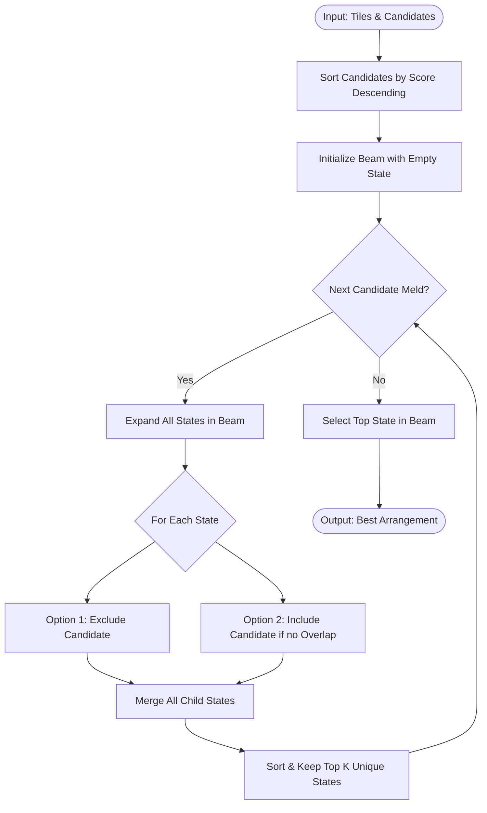

# Beam Search Solver Engine

## 1. Concept
The **Beam Search Solver** is a heuristic search algorithm that builds upon the concept of breadth-first search but restricts the search space at each level. Instead of keeping all possible partial arrangements in memory (which leads to combinatorial explosion) or choosing only a single path (like the Greedy solver), Beam Search maintains a fixed-size "beam" of the top-$K$ best partial arrangements.

---

## 2. Step-by-Step Workflow

1. **DTO Mapping**: Map input tiles and generated candidate melds to lightweight representations (`LightTile`, `LightMeld`) to minimize overhead.
2. **Candidate Sorting**: Sort all candidate melds by score descending.
3. **Initialization**: Initialize the beam with a single state: `(score = 0, mask = initial_mask, chosen_melds = [])`.
4. **Iterative Extension**:
   - For each candidate meld, expand all states currently in the beam.
   - For each state, generate two new states:
     - **Exclude Option**: Move to the next candidate without selecting this meld (retains current mask and score).
     - **Include Option**: If the candidate meld does not overlap with the state's current mask (i.e. tiles are still available), apply the meld, update the mask, add its score, and append it to `chosen_melds`.
5. **Beam Pruning**:
   - Sort all newly generated states by score descending.
   - Retain only unique states (using the tile availability mask to define state uniqueness).
   - Keep the top-$K$ (beam width) states.
6. **Result Reconstruction**: Return the best arrangement in the final beam and map back to Pydantic objects.

---

## 3. Algorithm Flowchart

---

## 4. Detailed Concrete Example

### Input Hand
* Hand tiles: `[Red 5, Red 6, Red 7, Blue 10, Black 10, Yellow 10, Red 12]`
* Candidate Melds (sorted by score):
  1. `Meld_A` (Blue 10, Black 10, Yellow 10) - Score: 30
  2. `Meld_B` (Red 5, Red 6, Red 7) - Score: 18

### Execution Trace (Beam Width $K=2$)
1. **Initial Beam**:
   - `State 0`: `(score=0, mask=1111111, melds=[])` (all 7 tiles available)

2. **Step 1: Evaluate `Meld_A`**:
   - **From `State 0`**:
     - *Exclude*: `(score=0, mask=1111111, melds=[])`
     - *Include*: `(score=30, mask=1110001, melds=[Meld_A])` (tiles at index 3, 4, 5 consumed)
   - **Pruning**: Keep both unique states in beam.
     - `Beam = [State_0_1(score=30), State_0_2(score=0)]`

3. **Step 2: Evaluate `Meld_B`**:
   - **From `State_0_1` (score=30, mask=1110001)**:
     - *Exclude*: `(score=30, mask=1110001, melds=[Meld_A])`
     - *Include*: `(score=48, mask=0000001, melds=[Meld_A, Meld_B])` (tiles at index 0, 1, 2 consumed)
   - **From `State_0_2` (score=0, mask=1111111)**:
     - *Exclude*: `(score=0, mask=1111111, melds=[])`
     - *Include*: `(score=18, mask=0001111, melds=[Meld_B])`
   - **Pruning**: Sort and keep top 2 unique states:
     - `Beam = [State(score=48, melds=[Meld_A, Meld_B]), State(score=30, melds=[Meld_A])]`

4. **Result**: Best state has score 48.
