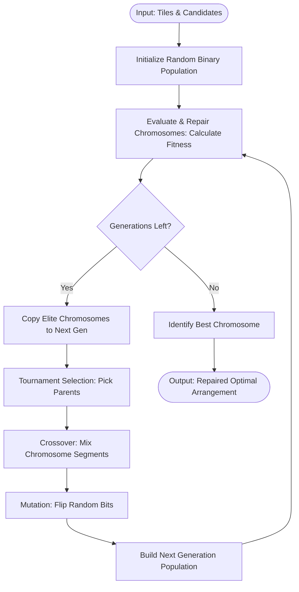

# Genetic Algorithm Solver Engine

## 1. Concept
The **Genetic Algorithm (GA) Solver** uses evolutionary principles to find high-scoring hand arrangements. It models candidates as binary chromosomes and applies selection, crossover, and mutation operators to evolve towards global optima. Overlapping tiles (conflicts) are resolved using a greedy repair heuristic.

---

## 2. Step-by-Step Workflow

1. **DTO & Mask Precalculation**: Map input tiles and melds to lightweight representations. Precalculate a bitmask for each candidate meld.
2. **Chromosome Representation**: Define a chromosome as a binary tuple where `1` indicates selecting the corresponding meld and `0` indicates excluding it.
3. **Population Initialization**: Randomly generate a population of $P$ chromosomes (e.g. size 40).
4. **Generation Loop** (Repeated $G$ times):
   - **Evaluation**: For each chromosome, sort selected meld indices by score/efficiency descending. Greedily pack non-overlapping melds to "repair" the chromosome and determine its fitness score.
   - **Elitism**: Directly copy the top-$E$ best chromosomes to the next generation.
   - **Parent Selection**: Use tournament selection to pick pairs of parent chromosomes.
   - **Crossover**: Combine parents (single-point crossover) with a probability rate (e.g. 0.8) to produce offspring.
   - **Mutation**: Flip genes (0 to 1 or 1 to 0) with a low probability rate to introduce genetic diversity.
5. **Reconstruction**: Identify the best-performing chromosome from the final generation, repair it, and build the final `Arrangement`.

---

## 3. Algorithm Flowchart

---

## 4. Detailed Concrete Example

### Input Hand
* Hand tiles: `[Red 5, Red 6, Red 7, Blue 10, Black 10, Yellow 10, Red 12]`
* Melds:
  * `Index 0`: `Meld_A` (Score: 30)
  * `Index 1`: `Meld_B` (Score: 18)

### Chromosome Evaluation & Repair
Suppose we have a chromosome: `(1, 1)` (representing selecting both `Meld_A` and `Meld_B`).
1. Selected Indices: `[0, 1]`.
2. Sorted by score descending: `[0, 1]` (Meld_A first, then Meld_B).
3. Apply Meld_A: mask updates, score = 30.
4. Apply Meld_B: no overlap with remaining mask, score becomes 30 + 18 = 48.
5. Fitness score is 48.

Suppose we have a conflicting chromosome (e.g. overlapping melds). The repair heuristic greedily takes the highest scoring meld first, rejecting the conflicting ones, which ensures every chromosome evaluates to a valid, rule-compliant arrangement.
