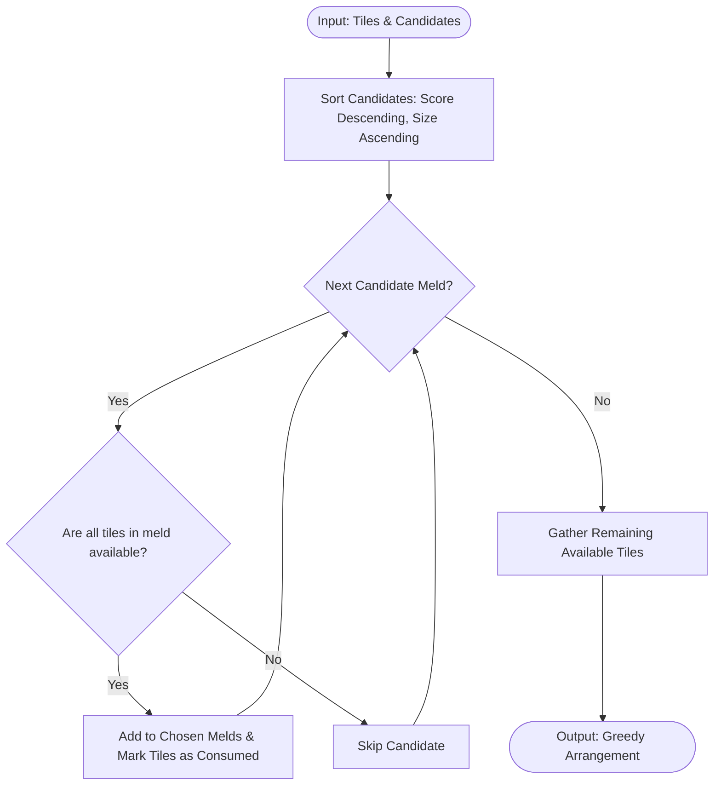

# Greedy Solver Engine

## 1. Concept
The **Greedy Solver** is a fast, heuristic-based algorithm that solves the hand arrangement problem by iteratively choosing the single best choice at each step. It avoids backtracking, recursive search, or mathematical programming solvers, prioritizing speed above all.

---

## 2. Step-by-Step Workflow

1. **DTO Mapping**: Map input tiles and candidates to lightweight objects.
2. **Sorting**: Sort all candidate melds by score descending. If scores are equal, prefer melds with fewer tiles (higher average efficiency per tile).
3. **Iterative Selection**:
   - Loop over the sorted candidate list.
   - For each candidate meld, check if all of its constituent tiles are still available.
   - If they are available, add the meld to the chosen list, add its score to the total, and remove its tiles from the available pool.
   - If any tile is already consumed, skip the candidate meld entirely.
4. **Reconstruction**: Gather all chosen melds and mark any remaining available tiles as unused.

---

## 3. Algorithm Flowchart

---

## 4. Detailed Concrete Example

### Setup
* Hand tiles: `[Red 5, Red 6, Red 7, Blue 6, Black 6]`
* Candidate Melds:
  1. `Meld_A` (Red 5, Red 6, Red 7) - Score: 18
  2. `Meld_B` (Red 6, Blue 6, Black 6) - Score: 18

### Execution Trace
1. Candidates are sorted. Since scores are equal (18), we break ties by size. Both have size 3. Let's assume sorting places `Meld_A` first.
2. **Evaluate `Meld_A`**:
   - All tiles `[Red 5, Red 6, Red 7]` are available.
   - Select `Meld_A`. Available tiles remaining: `[Blue 6, Black 6]`.
3. **Evaluate `Meld_B`**:
   - Config contains `Red 6`. But `Red 6` has been consumed by `Meld_A`.
   - Skip `Meld_B`.
4. **Result**: Chosen melds: `[Meld_A]`. Remaining tiles: `[Blue 6, Black 6]`. Total score: 18.
   - Note: If `Meld_B` was selected, the score would also be 18. In either case, the greedy choice of picking the first one prevents selecting overlapping options.
