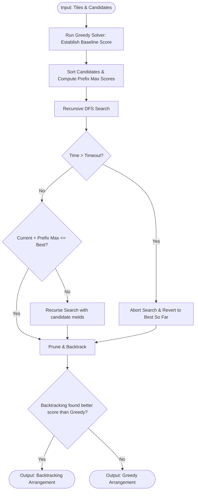

# Hybrid Solver Engine

## 1. Concept
The **Hybrid Solver** is a production-grade engine designed to deliver optimal or near-optimal arrangements while strictly adhering to real-time response constraints. It computes a greedy baseline to act as a lower bound, executes a Branch & Bound backtracking search pruned by prefix maximum scores, and falls back to the greedy result if a time limit (e.g. 50ms) is exceeded.

---

## 2. Step-by-Step Workflow

1. **Greedy Baseline**: Run `GreedySolver` to get an immediate lower bound score.
2. **Setup Search**: Initialize DTO mapping, bitmask representation, and start time tracking.
3. **Sort Candidates**: Sort candidate melds by score descending.
4. **Prefix Sum Table**: Build a prefix sum array `prefix_max_scores` where `prefix_max_scores[i]` is the sum of scores of all candidates from index $i$ to the end of the candidate list.
5. **Backtracking with Branch & Bound**:
   - At each recursive call:
     - **Timeout Check**: If elapsed time exceeds `timeout_ms`, interrupt search and exit.
     - **Pruning**: If the current score plus the maximum possible score from remaining candidates cannot beat the best score found so far, prune the branch:
       $$\text{current\_score} + \text{prefix\_max\_scores}[i] \le \text{max\_score}$$
     - **Recursion**: If valid, try including/excluding candidates recursively.
6. **Result Choice**: If the backtracking search completed or found a better arrangement than the greedy baseline, return it. Otherwise, return the greedy baseline.

---

## 3. Algorithm Flowchart

---

## 4. Detailed Concrete Example

### Setup
* Timeout: 50ms
* Greedy Baseline Score: 30

### Execution
During backtracking search at index 2, the current score is 10.
* Remaining candidate melds from index 2 have maximum possible scores of: 10, 8.
* `prefix_max_scores[2]` = 18.
* Maximum possible score for this branch: $10 + 18 = 28$.
* Since $28 \le 30$ (greedy baseline score), this branch is mathematically guaranteed to never exceed or equal the best score we can get. The solver prunes the branch immediately, avoiding hundreds of unnecessary recursive checks.
