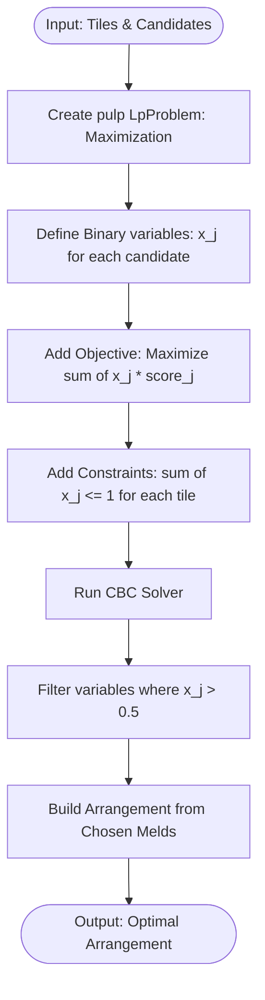

# Integer Linear Programming (ILP) Solver Engine

## 1. Concept
The **Integer Linear Programming (ILP) Solver** models the hand arrangement problem as a mathematical optimization problem. Specifically, it is formulated as a **Binary Set Cover** problem where each candidate meld is a decision variable $x_j \in \{0, 1\}$. By utilizing highly optimized linear programming libraries (such as `pulp` with CBC), it resolves optimal hand configurations extremely quickly.

---

## 2. Step-by-Step Workflow

1. **Problem Definition**: Initialize a maximization problem named `Okey_Hand_Arrangement` using `pulp.LpProblem`.
2. **Decision Variables**: Declare a binary decision variable $x_j$ for each candidate meld $j \in M$.
   - $x_j = 1$ if meld $j$ is chosen.
   - $x_j = 0$ if meld $j$ is excluded.
3. **Objective Function**: Maximize the sum of chosen meld scores:
   $$\text{Maximize } \sum_{j \in M} s_j x_j$$
   where $s_j$ is the score of candidate meld $j$.
4. **Constraints**: Define constraints to ensure no tile is used in more than one selected meld:
   $$\sum_{j: i \in \text{meld}_j} x_j \le 1 \quad \forall i \in H$$
   where $H$ is the hand's set of tiles.
5. **Solve**: Invoke `pulp.PULP_CBC_CMD(msg=False)` to solve the integer program.
6. **Reconstruction**: Inspect the variables. If $x_j > 0.5$, add candidate $j$ to the arrangement. Compute remaining unused tiles.

---

## 3. Algorithm Flowchart

---

## 4. Detailed Concrete Example

### Setup
* Hand tiles: `[t1, t2, t3]`
* Candidates:
  * `meld_0` containing `[t1, t2]` (Score: 10)
  * `meld_1` containing `[t2, t3]` (Score: 12)

### ILP Formulation
1. Variables: $x_0, x_1 \in \{0, 1\}$.
2. Objective:
   $$\text{Maximize } 10 x_0 + 12 x_1$$
3. Constraints:
   - For `t1`: $x_0 \le 1$
   - For `t2`: $x_0 + x_1 \le 1$
   - For `t3`: $x_1 \le 1$

### Solving
* If $x_0 = 1$, then $x_1$ must be 0 (due to $x_0 + x_1 \le 1$). Score = 10.
* If $x_1 = 1$, then $x_0$ must be 0. Score = 12.
* The solver selects $x_1 = 1, x_0 = 0$, giving an optimal score of 12.
