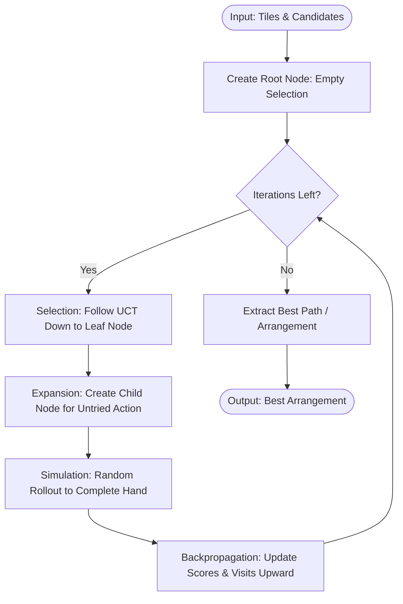

# Monte Carlo Tree Search Solver Engine

## 1. Concept
The **Monte Carlo Tree Search (MCTS) Solver** models the hand arrangement problem as a search tree of decisions. Each node in the tree represents a state of selected melds, and each branch/action represents selecting another valid, non-overlapping candidate meld. MCTS uses the UCT formula to balance exploration and exploitation, running random simulations (rollouts) to evaluate branch potential.

---

## 2. Step-by-Step Workflow

1. **Tree Initialization**: Create a root node representing the empty selection state with all hand tiles available.
2. **Search Iterations** (Repeated $I$ times):
   - **Selection**: Start at the root node. Traverse down the tree by choosing child nodes that maximize the UCT score:
     $$\text{UCT} = \frac{W_i}{N_i} + C \sqrt{\frac{\ln N_p}{N_i}}$$
     where $W_i$ is the node's accumulated rollout value, $N_i$ is its visit count, $N_p$ is parent visit count, and $C$ is the exploration constant.
   - **Expansion**: If the current node is not terminal and has untried valid meld selections (actions), create a child node representing one of those choices. Enforce a strict ordering on candidate indices to avoid permutation duplicates.
   - **Simulation (Rollout)**: From the expanded child node, perform a random playout. Continuously select compatible, non-overlapping candidate melds at random until no more melds can be added.
   - **Backpropagation**: Update the visits count and sum of rollout scores for the expanded node and all its ancestor nodes.
3. **Reconstruction**: Return the arrangement that yielded the absolute highest score across all iterations.

---

## 3. Algorithm Flowchart

---

## 4. Detailed Concrete Example

### Setup
* Iterations: 150
* Hand tiles: `[Red 5, Red 6, Red 7, Blue 10, Black 10, Yellow 10, Red 12]`
* Melds: `Meld_A` (Score: 30), `Meld_B` (Score: 18)

### Iteration Trace
1. **Iteration 1**:
   - Start at `Root (Visits=0)`.
   - **Expand**: Pick `Meld_A` (action 0). Create `Child_A` (mask updates).
   - **Rollout**: From `Child_A`, check valid actions. Only `Meld_B` is valid. Rollout chooses `Meld_B`. Final Score = 48.
   - **Backprop**: `Child_A` (Visits=1, Score=48), `Root` (Visits=1, Score=48).
2. **Iteration 2**:
   - Start at `Root`. Since `Root` has untried actions (action 1: `Meld_B`), we expand.
   - **Expand**: Pick `Meld_B`. Create `Child_B`.
   - **Rollout**: From `Child_B`, valid action is `Meld_A`. Final Score = 48.
   - **Backprop**: `Child_B` (Visits=1, Score=48), `Root` (Visits=2, Score=96).
3. **Iteration 3**:
   - Start at `Root`. No untried actions. Traverse children using UCT. Both `Child_A` and `Child_B` have identical UCT parameters. We select `Child_A`.
   - `Child_A` has no untried actions (fully expanded). We traverse to its child or simulate.
   - The tree continues growing towards the best layout branches, resulting in selecting the arrangement with the highest score (48).
