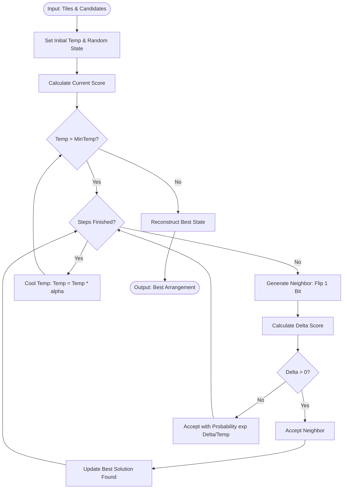

# Simulated Annealing Solver Engine

## 1. Concept
The **Simulated Annealing Solver** uses a thermodynamic optimization model to explore hand arrangements. It starts at a high temperature, allowing search to accept lower-scoring arrangements to escape local minima, and gradually cools down to refine and lock in high-scoring combinations.

---

## 2. Step-by-Step Workflow

1. **State Space Modeling**: Represent the current state as a binary vector corresponding to candidate melds.
2. **Initial State Selection**: Randomly initialize the state and calculate its score using the greedy repair heuristic.
3. **Loop Over Temperature Steps**:
   - For each temperature step:
     - **Neighbor Generation**: Generate a neighboring state by flipping one random bit in the state vector (toggling selection of a meld).
     - **Delta Evaluation**: Calculate the score difference: $\Delta = \text{neighbor\_score} - \text{current\_score}$.
     - **Acceptance Probability**:
       - If $\Delta > 0$ (better state), always accept the neighbor.
       - If $\Delta \le 0$ (worse state), accept the neighbor with probability:
         $$P(\text{accept}) = e^{\Delta / T}$$
         where $T$ is the current temperature.
4. **Cooling Schedule**: Reduce the temperature by multiplying with a cooling rate $\alpha$ (e.g. 0.95).
5. **Reconstruction**: Return the arrangement associated with the best-scoring state encountered during the run.

---

## 3. Algorithm Flowchart

---

## 4. Detailed Concrete Example

### Setup
* Initial Temperature: $T_0 = 100$
* Current State: `[0, 1]` (Meld_B selected, Score: 18)
* Neighbor State generated by flipping index 0: `[1, 1]` (Meld_A and Meld_B selected, Score: 48)
* $\Delta = 48 - 18 = +30$. Since $\Delta > 0$, we accept the neighbor. New Current State: `[1, 1]`.

Suppose the current score is 48, and we flip a bit to get `[1, 0]`, yielding score 30.
* $\Delta = 30 - 48 = -18$.
* Acceptance probability: $P = e^{-18 / 100} \approx 0.835$.
* We roll a random float. If it is less than 0.835, we transition to the worse state to keep exploring alternative layouts.
* As $T$ cools (e.g. $T = 0.5$), $P = e^{-18 / 0.5} \approx 0.000$, and worse moves are almost never accepted.
